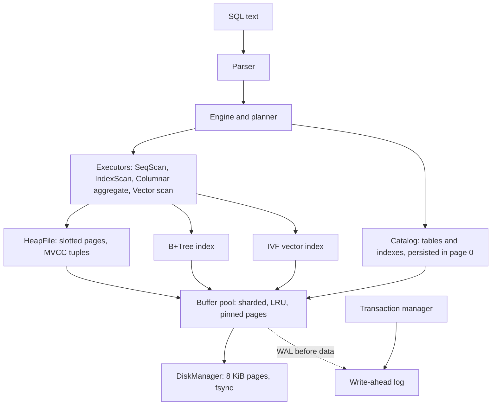
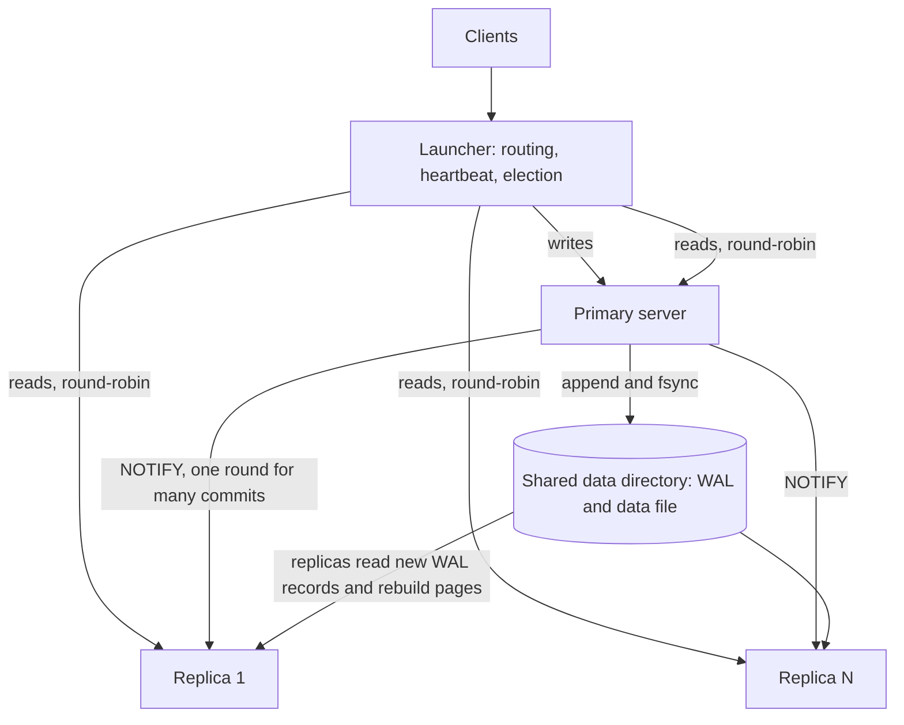
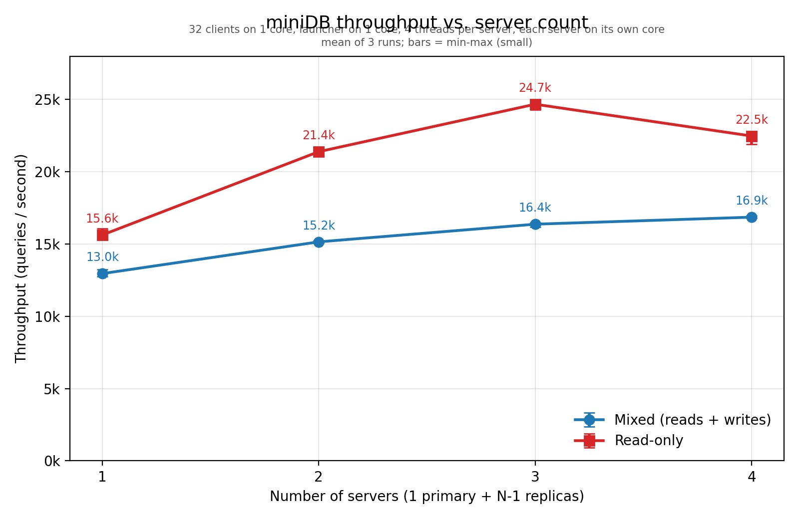

# miniDB

A relational database engine written from scratch in C++20. It has a write-ahead log with crash recovery, MVCC transactions, B+Tree indexes, an in-memory columnar cache for analytics, IVF vector search, and a
primary/replica cluster with automatic failover.

About 6,700 lines of C++ including tests. No third-party dependencies: the C++ standard
library and POSIX only.

## Features

| Area | What it does |
|---|---|
| **Storage engine** | 8 KiB pages, page-file `DiskManager`, sharded buffer pool with LRU eviction and pin counts, `fsync` durability |
| **Write-ahead log** | Append-only, length-prefixed records; the WAL-before-data rule is enforced at eviction, flush and checkpoint; redo-only recovery that is idempotent and safe to re-run |
| **Transactions** | MVCC with `xmin`/`xmax` tuple headers, Read Committed visibility, slotted-page heap files. Aborted or in-flight work simply stays invisible, so no undo pass is needed |
| **SQL** | `CREATE TABLE`, `CREATE INDEX`, `CREATE VECTOR INDEX`, `INSERT`, `SELECT` (filters, projection, aggregates, nearest-neighbour), `DELETE`, `REFRESH COLUMNAR` |
| **Indexing** | Persistent B+Tree over `INTEGER` columns; duplicate-key safe; maintained on insert; survives restarts |
| **Analytics** | Optional in-memory **columnar cache** for `COUNT/SUM/AVG/MIN/MAX`; the planner picks it over a row scan (about 120x faster on the bundled 5,000-row benchmark) |
| **Vector search** | `VECTOR(n)` columns and an **IVF** index (k-means clusters, page-chained posting lists); `ORDER BY col <-> [..] LIMIT k`, including filtered ("hybrid") search |
| **Clustering** | One primary plus N replicas over a shared data directory; replicas rebuild pages from the WAL; heartbeat failure detection and automatic promotion with epoch fencing |
| **Concurrency** | Thread-safe buffer pool and catalog; `epoll`-based servers; ThreadSanitizer / AddressSanitizer / UBSan clean during development |

## Architecture

### One node



### A cluster



**Layers** (each is a directory under `include/` and `src/`):

| Directory | Contents |
|---|---|
| `storage/` | `DiskManager`, `WALManager`, `BufferPool`, `RecoveryManager`, page format |
| `transaction/` | `TransactionManager`, `HeapFile` (slotted pages, tuple headers, MVCC visibility) |
| `query/` | SQL parser, `Engine`/planner, executors, `Catalog`, `BPlusTree`, `ColumnStore`, `IVFIndex`, `Value` |
| `distributed/` | `DbServer`, `Launcher`, network utilities (`PersistentConnection`, epoll serving) |
| `tests/` | Unit and failure-injection tests, plus the cluster `benchmark` and `run_bench.sh` |

## Quick start

**Requirements:** a Linux or WSL2 environment, a C++20 compiler (GCC 11+ or Clang 14+), CMake 3.12+.

### Build

```bash
cmake -S . -B build
cmake --build build
cmake --install build
```

### Run the tests

```bash
./test_transaction_cases    # MVCC visibility and commit / abort behaviour
./failure_handling          # crash-and-recover: pages written only to the WAL come back
./test_query_engine         # parser, catalog, indexes, columnar, vector search, restarts
```

The test binaries end with `ALL CHECKS PASSED` (`failure_handling` prints the recovered pages).

### Start a cluster

The launcher starts the servers as `./server`, so run it from the directory that contains both
`launcher` and `server`:

```bash
./launcher --servers=3 --threads=4 --data-dir=/tmp/minidb
```

| Flag | Meaning |
|---|---|
| `--servers` | number of server processes (server 0 is promoted to primary) |
| `--threads` | worker threads per server |
| `--data-dir` | directory holding the shared data file and WAL (must exist) |
| `--base-port` | first port for servers, default `20000` (query and control port per server) |
| `--client-port` | the port clients connect to, default `19999` |

### Talk to it

Clients send one SQL statement per line to the launcher's client port and get one line back.
Netcat works:

```bash
nc localhost 19999
```

```text
> CREATE TABLE users (id INT, name TEXT, age INT)
OK	0		
> CREATE INDEX idx_users_id ON users (id)
OK	0		
> INSERT INTO users VALUES (1, 'alice', 31)
OK	1		
> INSERT INTO users VALUES (2, 'bob', 27)
OK	1		
> INSERT INTO users VALUES (3, 'carol', 45)
OK	1		
> SELECT * FROM users WHERE id = 2
OK	0	id,name,age	2;bob;27
> SELECT name FROM users WHERE age > 30
OK	0	name	alice|carol
> SELECT AVG(age) FROM users
OK	0	AVG(age)	34.3333
> DELETE FROM users WHERE id = 1
OK	1		
> SELECT * FROM nope
ERR ExecuteSelect: Unknown table nope
```

Vector search:

```text
> CREATE TABLE docs (id INT, emb VECTOR(3))
> INSERT INTO docs VALUES (1, [0.1,0.2,0.3])
> INSERT INTO docs VALUES (2, [0.9,0.8,0.7])
> INSERT INTO docs VALUES (3, [0.11,0.19,0.31])
> CREATE VECTOR INDEX idx_emb ON docs (emb) LISTS 2
> SELECT id FROM docs ORDER BY emb <-> [0.1,0.2,0.3] LIMIT 2
OK	0	id	1|3
```

**Response format:** `OK<TAB>rows_affected<TAB>columns<TAB>rows` where columns are comma-separated,
fields within a row are separated by `;`, and rows by `|`. Errors are `ERR <message>`.

Write statements (`INSERT`, `DELETE`, `CREATE ...`) are routed to the primary; reads are spread
round-robin across all live servers.

## SQL reference

| Statement | Notes |
|---|---|
| `CREATE TABLE t (c1 INT, c2 TEXT, c3 VECTOR(n))` | Types: `INT`, `TEXT`, `VECTOR(n)` |
| `CREATE INDEX name ON t (col)` | B+Tree on an `INT` column; backfills existing rows |
| `CREATE VECTOR INDEX name ON t (col) LISTS k` | IVF index with `k` k-means clusters |
| `INSERT INTO t VALUES (...)` | Vectors are written `[0.1,0.2,0.3]`; text in single quotes |
| `SELECT cols\|* FROM t [WHERE p [AND p ...]]` | Operators: `=  !=  <  <=  >  >=` |
| `SELECT COUNT\|SUM\|AVG\|MIN\|MAX(col) FROM t [WHERE ...]` | Uses the columnar cache if one is loaded |
| `SELECT ... ORDER BY vec_col <-> [..] LIMIT k` | L2 nearest neighbours; a `WHERE` clause makes it a hybrid search |
| `DELETE FROM t [WHERE ...]` | MVCC delete: sets `xmax`, no immediate reclamation |
| `REFRESH COLUMNAR t` | (Re)builds the in-memory columnar cache from committed rows |

**Planner behaviour**
- An equality predicate on an indexed `INT` column uses the B+Tree (`IndexScan`); everything else is a `SeqScan`.
- Aggregates use the columnar cache when it exists. The cache is **not updated automatically**, so results are stale until the next `REFRESH COLUMNAR`.
- Vector queries probe 4 clusters (fewer if the index has fewer), then rank candidates by exact distance.

## How it works

**Crash recovery.** Every page modification appends a WAL record holding the *full after-image* of
the page. A page may be written to the data file only after the WAL is flushed up to that page's
LSN. A commit is one WAL `fsync`. After a crash, recovery scans from the last checkpoint and
re-applies any record whose LSN is newer than the page's on-disk LSN. It is idempotent, so a crash
during recovery is harmless. There is no undo phase: uncommitted tuples are invisible under MVCC.

**MVCC.** Each tuple carries `xmin` (creator) and `xmax` (deleter). A tuple is visible to a reader
if its creator is committed (or is the reader itself) and it has no committed deleter. The set of
committed transactions is rebuilt from the WAL at startup, which also lets replicas learn about
commits by reading the log.

**B+Tree.** Persistent, page-based, with leaf-linked ranges. Splits are aware of duplicate-key runs so
exact-match lookups stay correct. Root changes are recorded in the catalog.

**Columnar cache.** A per-table, in-memory column-major copy of committed rows built by
`REFRESH COLUMNAR`. Aggregates run as tight loops over contiguous arrays.

**IVF vector index.** k-means partitions vectors into clusters; each cluster keeps a page-chained
posting list. A query probes the nearest clusters and ranks their members by exact L2 distance.

**Replication.** All servers share one data directory. The primary is the only writer; replicas open
the files read-only.
1. On commit the primary flushes the WAL, then asks replicas to catch up (a `NOTIFY`). Concurrent
   commits share one notification round (leader/follower batching), so the round trip is amortised.
2. A replica reads new WAL records from its own offset. It learns which transactions committed,
   records the newest WAL record for every page, invalidates its cached copies, and reloads the
   catalog if the catalog page changed.
3. On a cache miss a replica **rebuilds the page from the WAL** (the latest full-page image at or
   below its sync point) instead of reading the data file, which can be *ahead* of the replica.
   Replicas therefore never ask the primary to flush anything. (The older flush-and-verify path
   remains selectable with `MINIDB_REPLICA_MODE=flush` for comparison.)
4. The primary writes pages to the data file lazily, on eviction. A promoted replica runs normal
   recovery to catch the data file up.

**Failover.** The launcher pings the primary every 300 ms. After 3 consecutive misses it promotes
the lowest-numbered live server: that server takes an exclusive `flock` on `primary.lock`, bumps
the epoch, runs recovery, and rebuilds its engine. The other servers are then told who the new
primary is. `NOTIFY`s carrying an older epoch are rejected. Writes resumed in 2-3 s in testing.

Control-port messages (for debugging): `PING`, `STATUS`, `STATS`, `PROMOTE`, `SETPRIMARY`,
`NOTIFY <epoch>`, `FLUSHPAGE <id>`. `STATS` on a replica reports how many pages were served from
the WAL, and on the primary how many commits shared each notification round.

## Performance

All numbers are from one machine: a laptop under WSL2 (20 logical CPUs), using 6 cores. The
**clients (1 core) and launcher (1 core) share single cores**, and each server is pinned to its own
core with 4 worker threads. Treat them as a demonstration of behaviour, not as absolute figures.

### Cluster scaling

32 clients, mean of 3 runs. The mixed workload is roughly 41% inserts, 30% point reads, 14%
aggregates and 15% vector queries; the read-only workload is the same mix without inserts.
Every run finished with 0 errors.



| Servers | Mixed (QPS) | Speedup | Read-only (QPS) | Speedup |
|---|---|---|---|---|
| 1 | 12,956 | 1.00x | 15,629 | 1.00x |
| 2 | 15,152 | 1.17x | 21,391 | 1.37x |
| 3 | 16,374 | 1.26x | 24,675 | 1.58x |
| 4 | 16,860 | 1.30x | 22,476 | 1.44x |

Raw runs and statistics are in [`results/scaling_summary.csv`](results/scaling_summary.csv). Reproduce
with `tests/distributed/run_bench.sh` (e.g. `CLIENTS=32 SERVER_THREADS=4 ./run_bench.sh mixed`).

The read-only curve flattens at 3 servers because the single launcher core (about 40 us of CPU per
query, so roughly 25k QPS per core) becomes the limit, not the database servers.

### Component benchmarks (from the test suite)

| Feature | Result |
|---|---|
| Columnar vs row-store `SUM`, 5,000 rows | 4.45085 ms vs 0.033404 ms (about 130x), identical answers |
| IVF recall@10, 20 clusters | 0.5 at nprobe=1, 0.7 at 2, 1.0 at 4 |

## Testing and verification

- `test_transaction_cases`: 14 checks on MVCC visibility, commit and abort.
- `test_query_engine`: 56 checks across 17 scenarios: DML, catalog persistence across restarts,
  index maintenance, columnar vs row planner choice and staleness, vector search, hybrid search, recall.
- `failure_handling`: writes pages only to the WAL, simulates a crash, and verifies 16 pages are
  restored by recovery.
- Cluster: repeated mixed and read-only runs with 1-4 servers (zero errors), replica-kill and
  primary-kill (failover) scenarios, and concurrent writers during failure.

## Limitations

- **Single host.** Replicas are processes sharing one directory. There is no network storage layer, so this is not a multi-machine deployment.
- **The launcher is a single coordinator**, not a consensus group. Election picks the lowest live server ID.
- **Replica failure is not handled.** A dead replica stays on the primary's notify list, so writes return an error (the data is durable in the WAL, but replication was not acknowledged) until it is restarted.
- **No WAL truncation and no periodic checkpoint.** Recovery replays the whole log, and replicas keep an in-memory index over it.
- **SQL surface is small:** no `UPDATE`, joins, `GROUP BY`, general `ORDER BY`, or multi-statement transactions over the wire (each statement auto-commits). Isolation is Read Committed only.
- **No vacuum:** deleted tuples are never reclaimed.
- **No page or WAL checksums.**
- **Planner:** the B+Tree is used only for equality on an indexed `INT` column; the columnar cache must be refreshed manually; vector search is L2 only with a fixed probe count.
- **Sizes are fixed at compile time:** the server's buffer pool is 128 frames (1 MiB) and the catalog must fit in one page.

## Project layout

```text
include/  storage/ transaction/ query/ distributed/    headers, one directory per layer
src/      storage/ transaction/ query/ distributed/    implementations (+ server and launcher mains)
tests/    query/ storage/ transaction/ distributed/    tests, cluster benchmark, run_bench.sh
docs/     scaling_graph.png, scaling_summary.csv, DEVELOPMENT_LOG.md
```